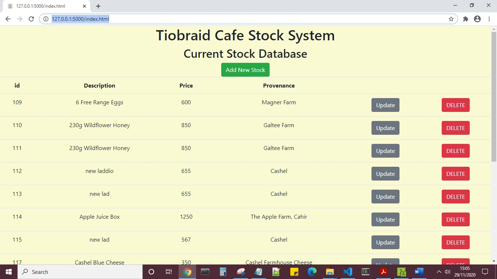
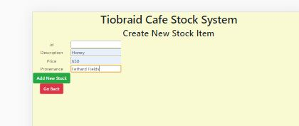

# dataRepresentationProject

GMIT Data Representation Module Project 2020. 
Course: Higher Diploma in Data Analytics, GMIT, Ireland 
Lecturer: Andrew Beatty 
Author: Clodagh Murphy 
Email: g00376300@gmit.ie 
Dates: October- December 2020 

Web application project 
Build a basic Flask server that has a REST API to perform CRUD operations include one database table and
a web interface. 

The repository contains:
* This `README.md` file
* Files that form the Web application project option.

1. `.gitignore` - includes reference to config.py and venv, so that when it is downloaded, the repository won't damage that person's own configuration.
2. `config.py` - the purpose of the configuration file is to create the initial settings for the project, thus avoiding hardcoded data.  
A newuser can amend this file to include their own local settings (e.g., user name and password) before proceeding.
3. `requirements.txt` - what is needed is set out clearly in this separate file. 
It used for specifying what python packages (and versions) are required to run this project. 
To install your packages using requirements.txt:

* Open a terminal or command prompt 
* Navigate to the folder with requirements.txt 
* run: pip install -r requirements.txt 
* Installation of dependencies is complete. 

4. `server.py` - The server programme is simple, with the “heavy lifting” carried out in the DAO.
5. `server.py` - 
6. `index.html` - Accompanying web interface, uses AJAX calls, to perform these CRUD operations is saved in the `staticpages` folder
7. `foodie.ico` - a favicon that provides a small food themed image displayed in the browser address bar
8. `initdb.sql`- the sql code to create a database similar to the one used in this project

## Instructions for downloading this repository
Log on to GitHub and search for user ClodaghMurphy, the repository is entitled dataRepresentationProject. 
On github.com choose the "Clone or download" button to copy the code onto your machine. 
For further information on how github works video guides are available here https://www.youtube.com/githubguides 

## How to run the files and view the functionality of this project
After download and installation of requirments.txt, open server.py on the command line 
Confirmation that this file has linked to the Data Access Object (DAO) is printed to the screen 
connection @ __init__ made with stockDAO.py 
The Flask app is being served! 
Cut and paste local host URL that appears on the screen into a browser. 
Database contents can be view in json format at http://127.0.0.1:5000/stock 
Navigate to http://127.0.0.1:5000/index.html 

This is a stock control system for the Tiobraid Cafe. 
The landing page index.html displays all available stock (select * from stock). 
Options are Add New Stock, Update or Delete current stock. 
The buttons are colour coded, a bootstrap convention to convey meaning. 
When creating a new stock item, the programme will only accept numerical values in the price field. 
Select "Go Back" if there is no requirement to create a  new item. 

